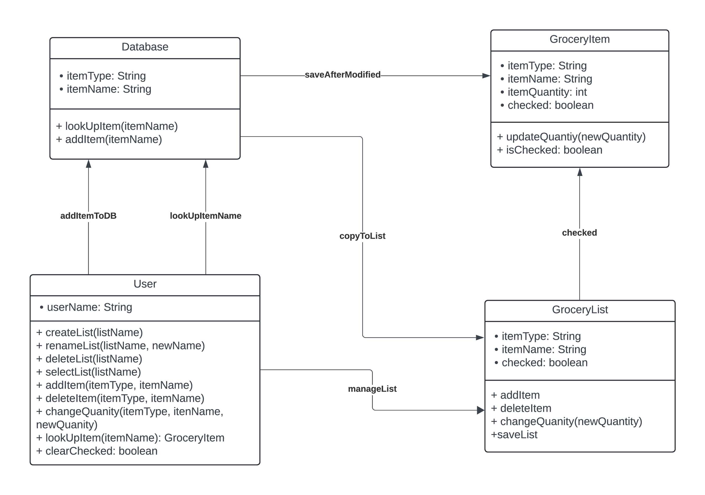
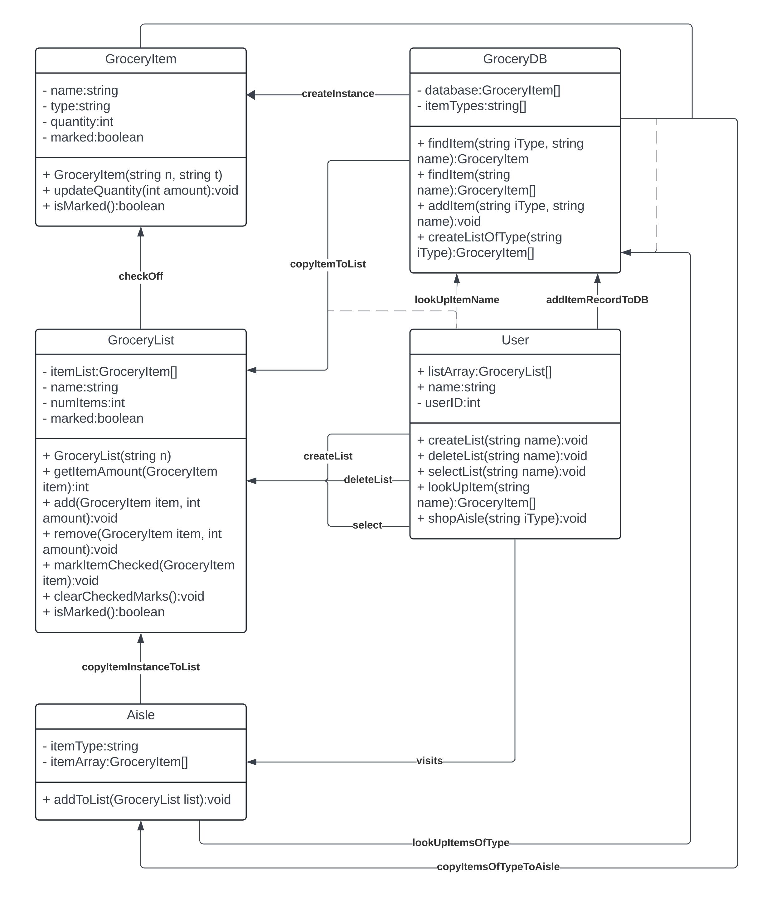
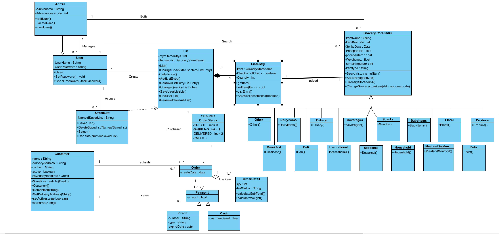
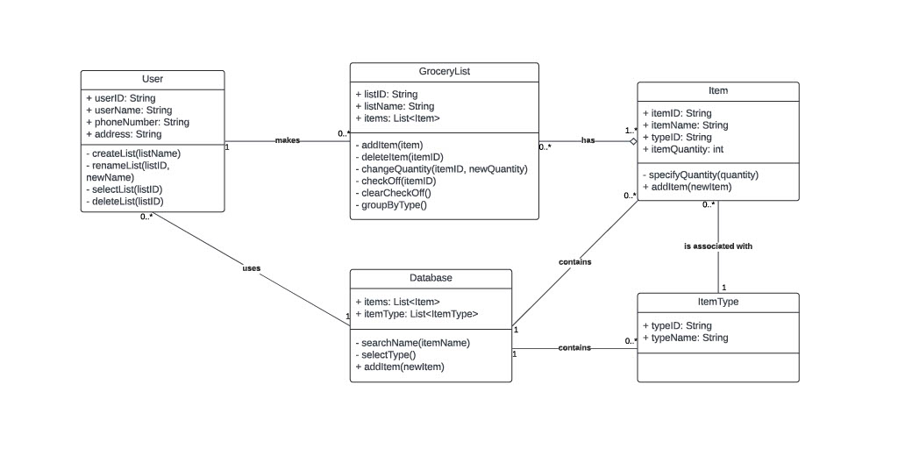
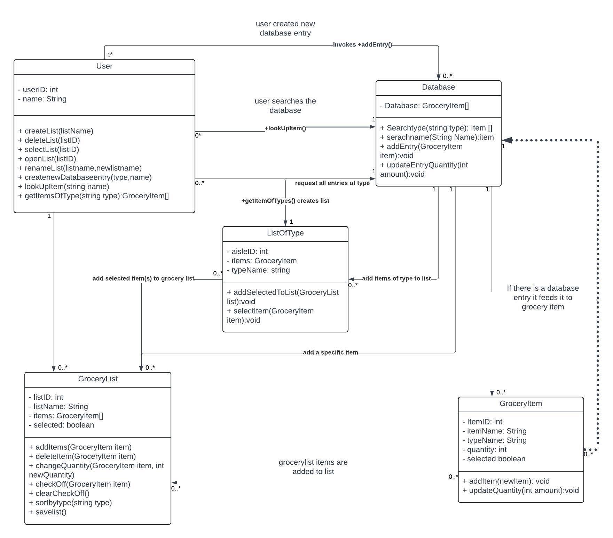

# Design Discussion-Team Two
## Design 1 
### Pros
- The **Grocerylist** class and **Item** class are clearly defined
- Most the functionality is under the the **User** class
- A method to update the quantity `UpdatedQuantity()` class.

### Cons
- The UML does not feature Multiplicity.
- It lacks the functionality to save several list
- It lacks the functionality to present the items in a list grouped by type

## Design 2  
### Pros
- the **Aisle class** allows the user to search by type

### Cons
- The UML does not feature Multiplicity.
- It lacks the functionality to rename a list.
- It lacks the functionality to save a list.  

## Design 3 
### Pros
- the **ListEntry** class is a good idea 

### Cons
- the Class hierarchy is cumbersome.
- the design is over-engineered.
- It lacks the functionality to sort list by type.

## Design 4  

### Pros
- The ListID attribute acts like a primary key, there is a clear distinction between itemID and ItemName

### Cons
- It lacks the functionality to sort list by type.
- There is not a clear purpose for **ItemType** to be a class of its own.

## Design 5 

### Pros
- The UML is Straight forward and easy to read
### Cons
- The `GetitemfromType()` method is unnecessary. 
- The **User** does not have access to the database
- The `ChooseList()` lacks a input.

# Team Design

In our Team Design we chose to keep the **User**, **Database**,**GroceryItem** and **GroceryList** classes while adding a separate **ListOfType** class to enable the database to create lists of a particular type of product. We also made sure to label the Multiplicity for all relationships between our classes which was missing in some designs.The reason we chose this as our team design is because it seems the most straight forward to both implement and understand while maintaining all the functionality demanded by the requirements.
# Summary
We learned the importance of having open ,inclusive and at times critical dialogues . These dialogues helped facilitate a common understanding for what the team design should be and what each team member could improve upon with their dialogue. We also learned that there is merit to actively posting comments when working on a diagram as a group,especially when working alone in separate time periods. Additionally, We learned how designs created to meet the same requirements can vary drastically and how to determine which seemed like "path of least resistance" vis-à-vis implementation.   

