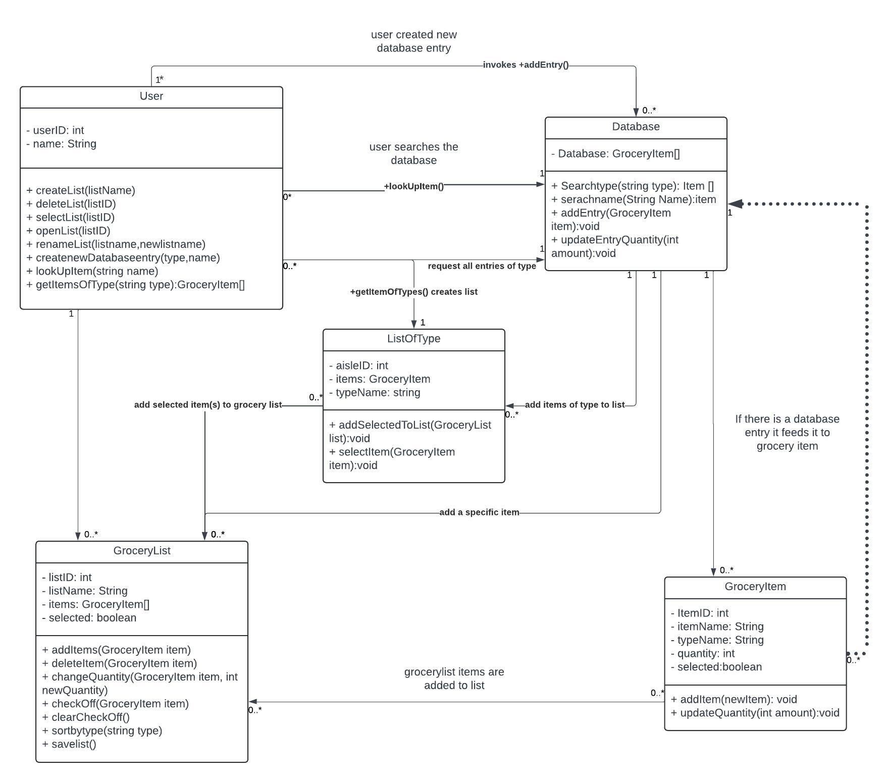

# Design Document

**Author**: Zachary Kleiman, Jatin K. Marwaha

## 1 Design Considerations

### 1.1 Assumptions

We are creating an application that will enable the user to create , maintain and edit a grocery list. Assuming a User knows what products they want prior to shopping this would enable them to gain more utility from creating grocery lists.

The Application will have the following Dependencies:
- Toast: to alert the user when required.
- Android Studio: To compile the app since it's used to create the GUI.

### 1.2 Constraints

The User should be able to add any product they desire to the system. which means the size of the database must expand to accommodate user entries. 
### 1.3 System Environment

This application will be targeted at API Level 31 of Android. We are therefore targeting all phones that can run Android 12 and higher.

## 2 Architectural Design

*The architecture provides the high-level design view of a system and provides a basis for more detailed design work. These subsections describe the top-level components of the system you are building and their relationships.*

### 2.1 Component Diagram

*This section should provide and describe a diagram that shows the various components and how they are connected. This diagram shows the logical/functional components of the system, where each component represents a cluster of related functionality.*

### 2.2 Deployment Diagram

*This section should describe how the different components will be deployed on actual hardware devices.*

## 3 Low-Level Design

*Describe the low-level design for each of the system components identified in the previous section. For each component, you should provide details in the following UML diagrams to show its internal structure.*

### 3.1 Class Diagram

### 3.2 Other Diagrams
#### State Diagram 

## 4 User Interface Design
*For GUI-based systems, this section should provide the specific format/layout of the user interface of the system (e.g., in the form of graphical mockups).*

