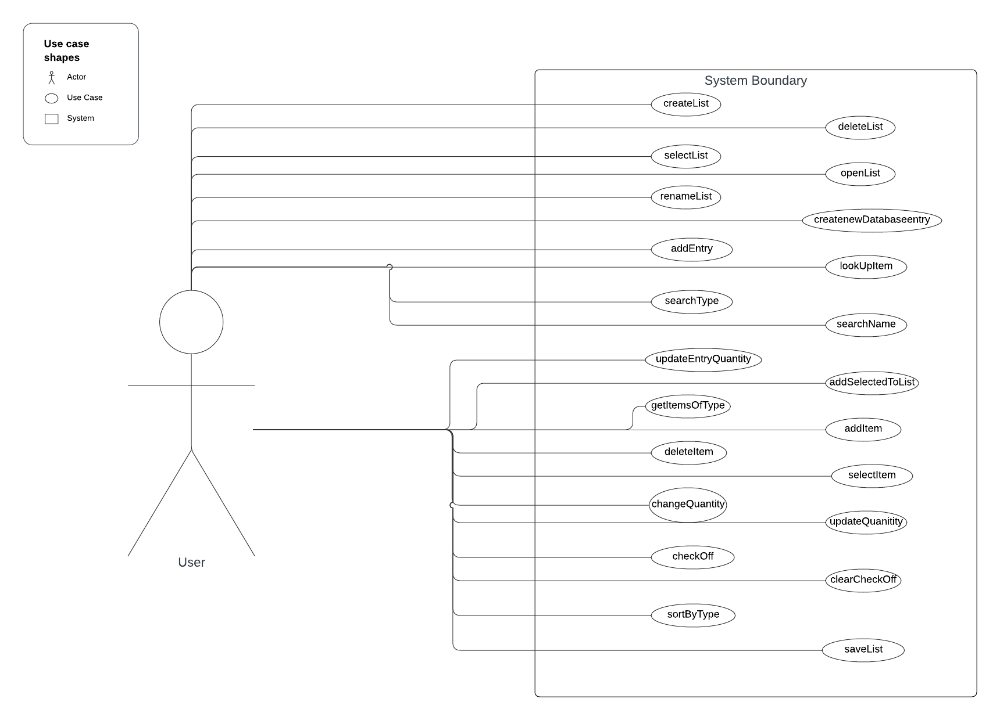

# Use Case Model

**Author**: \<Lijie Wan\>

## 1 Use Case Diagram

The use case diagram visually represents the interaction between the user (actors) and the system (grocery list application). It includes the actor who is a customer in this case. The use cases connected to the actor illustrate all the functionalities such as "createList", "deleteList", "checkOff", "clearCheckOff", "addItem", and "updateQuantity".

## 2 Use Case Descriptions

### Use Case 1:

| Use Case | Create List |
|----|----| 
| **Requirements** | Allow the user to create a new named list within the system for organizing and tracking items.|
| **Pre-conditions** | User can be logged into the system |
| **Post-conditions** | A new list with a specified name is created and appears within the user's account. The list is empty and ready for items to be added. |
| **Scenarios** | **Normal:** 1. User selects the option to create a new list. 2. The user enters a name for the list in the system. 3. The system checks that the name is unique. 4. The system creates the list for the user. **Alternate:** 1. The user enters an existing name.  2. The system prompts the user to enter a different name. 3. The user gives a new name and the system creates the list. **Exceptional:**  1. The user receives an error message. 2. The system encounters an issue while creating the list. |

### Use Case 2:

| Use Case | Delete List|
|----|----| 
| **Requirements** | Allow the user to permanently remove an existing list in their account. This action can contain a confirmation step to prevent accidental deletions.| 
| **Pre-conditions** | User has ownership of the list they intend to delete. |
| **Post-conditions** | The selected list is removed from the user's account and the system's storage. All the data in the list is no longer accessible.|
| **Scenarios**| **Normal:** 1. The user accesses the lists area and views all existing lists. 2. The user selects the list they intend to delete. 3. The system prompts the user to confirm the deletion to prevent accidental data loss. 4. The system removes the list. **Alternate:** 1. The user cancels the deletion after the confirmation prompt. 2. The system cancels the deletion and retains the list without changes. **Exceptional:** 1. The user confirms deletion, but the system encounters an error. 2. The system displays an error message. 3. The user is prompted to try again later or contact customer support for assistance. |

### Use Case 3:

| Use Case | Select List|
|----|----| 
| **Requirements** | Allow the user to choose their existing lists to perform actions such as viewing, editing, or deleting. | 
| **Pre-conditions** | User can access their previously created lists by logging in. |
| **Post-conditions** | The chosen list becomes the active context and is displayed for the user to take the next action. |
| **Scenarios**| **Normal:** 1. The user accesses the dashboard where all their lists are displayed. 2. The user clicks on the list they wish to interact with. 3. The system marks the list as selected. **Alternate:** 1. The user attempts to select a list but realizes they open the wrong one. 2. The user navigates back to the dashboard and selects the correct list. **Exceptional:** 1. The user selects a list but the list does not open or is active due to the system error. 2. The system informs the user of the error and suggests they try again. 3. If the problem cannot be solved, then the user is advised to contact support. |

### Use Case 4:

| Use Case | Open List|
|----|----| 
| **Requirements** | User must have the ability to open and review contents including items and details of any lists they have created. | 
| **Pre-conditions** | The User has at least one list created in their account and has one list selected. |
| **Post-conditions** | The selected list has been opened and the user can view all the items and details. |
| **Scenarios** | **Normal:** 1. The user navigates to their collection of lists and selects one. 2. The user clicks the open list option. 3. The system displays all the content of the list. **Alternate:** The user does not open the list after selecting it and returns to the list collection. **Exceptional:** 1. The user clicks the open list option, but the system encounters a loading error. 2. The system displays an error message to inform the user to try to open it again. 3. If the error still exists, the user is advised to contact support. |
  
### Use Case 5:

| Use Case | Rename List|
|----|----| 
| **Requirements** | Allow users to change the name of any list they have created. The rename feature should ensure the list's name remains unique. | 
| **Pre-conditions** | User can access their existing lists and have one list selected to perform the next action. |
| **Post-conditions** | The list's name is updated to a new name. |
| **Scenarios** | **Normal:** 1. The user selects the list they wish to change the name with. 2. The user clicks the rename list option. 3. The user inputs a new unique name. 4. The system checks the uniqueness of the new name. 5. The system updates the list's name and confirms the change to the user. **Alternate:** 1. If the new name is already exited, the system prompts the user to enter a different name. 2. The user inputs another name and the system retries the same process. **Exceptional:** 1. The system encounters an issue when attempting to update the list's name. 2. The system displays an error message and suggests the user try again. 3. If the error still exists, the user is advised to contact customer support for further assistance. |

### Use Case 6:

| Use Case | Create New Database Entry |
|----|----| 
| **Requirements** | User can add new item types to the system's database. | 
| **Pre-conditions** | User can modify the database. |
| **Post-conditions** | The database is updated with new item types. |
| **Scenarios** | **Normal:** 1. The user navigates to the database dashboard. 2. The user selects the option to create a new database entry. 3. The user enters the required information needed for the new item type, such as name. 4. The system checks the uniqueness of the name. 5. The system adds the new item type to the database. **Exceptional:** 1. If the information the user enters is not complete or incorrect, the system displays an error message and requests the correct information. 2. If there is a system or database error during the process, the system prompts the user to try again.  |

### Use Case 7:

| Use Case | Add Entry |
|----|----| 
| **Requirements** | User can add new item types to the system's database. | 
| **Pre-conditions** | User is able to modify the database. |
| **Post-conditions** | The database is updated with new items. |
| **Scenarios** | **Normal:** 1. The user navigates to the database dashboard. 2. The user selects the option to create a new database entry. 3. The user enters the required information needed for the new item. 4. The system checks the information. 5. The system adds the new item to the database. **Exceptional:** 1. If the information the user enters is not complete or incorrect, the system displays an error message and requests the correct information. 2. If there is a system or database error during the process, the system prompts the user to try again. |

### Use Case 8:

| Use Case | Search Type |
|----|----| 
| **Requirements** | User should be able to search items based on their type in the database. | 
| **Pre-conditions** | The database has items categorized by type and the user can access the database. |
| **Post-conditions** | The list of items under the type that the user wishes to search is displayed on the dashboard. |
| **Scenarios** | **Normal:** 1. The user accesses the search feature in the database. 2. The user enters the type and clicks the search type option. 3. The system retrieves all items matching the entered type. 4. The system displays the result on the dashboard. **Alternate:** If no items match the search type, then the system informs the user and suggests user similar type items or options to add the new item to the database. **Exceptional:** 1. If the system fails to retrieve items due to an error, then an error message will show to the user. 2. If the error still exists after retiring,  the system suggests the user contact support. |

### Use Case 9:

| Use Case | Search Name |
|----|----| 
| **Requirements** | User should be able to search items by their name in the database. | 
| **Pre-conditions** | Items in the database have unique names and the user can access the database. |
| **Post-conditions** | Search results match the search name. |
| **Scenarios** | **Normal:** 1. The user accesses the item search interface in the database. 2. The user enters the name of the item and clicks the search type option. 3. The system processes the query. 4. The system displays the items that match the input name or partial name to the dashboard. **Alternate:** If no items match the search name, then the system informs the user and suggests user add the new item to the database. **Exceptional:** 1. The operation encounters an error due to system issues and the system prompts the user to try again later. 2. If the problem persists, the system advises the user to contact the support. |

### Use Case 10:

| Use Case | Update Entry Quantity |
|----|----| 
| **Requirements** | User is able to adjust the stock quantity of an item within the database. | 
| **Pre-conditions** | The User is able to edit database entries and the item that needs to be updated is selected.  |
| **Post-conditions** | The quantity of the selected item in the database is updated. |
| **Scenarios** | **Normal:** 1. The user selects the item that needs to be updated. 2. The user enters the new quantity for the item. 3. The system validates the input and updates it to the new quantity in the database. **Exceptional:** 1. The system encounters an error while updating the quantity. 2. The user is notified of the error and prompted to retry. 3. If the problem persists, the system advises the user to contact technical support. |
  
### Use Case 11:

| Use Case | Look Up Item |
|----|----| 
| **Requirements** | The system enables the user to search items by their name or type in the database. | 
| **Pre-conditions** | The user can access the database and the database contains items entries that can be searched. |
| **Post-conditions** | The system displays the items that match the search criteria. |
| **Scenarios** | **Normal:** 1. The user navigates to the search interface. 2. The user enters the information. 3. The system searches the database for items that match the information that the user enters. 4. The system displays the results. **Alternate:** If no results were returned, then the system informs the user and suggests user to try again. If still no result is found, then the system suggests user add the new item to the database. **Exceptional:** 1. The operation encounters an error due to system issues and the system prompts the user to try again later. 2. If the problem persists, the system advises the user to contact the support. |

### Use Case 12:

| Use Case | Get Items Of Type |
|----|----| 
| **Requirements** | The system must allow users to retrieve a list of items from the database that are categorized under a type to their grocery lists. | 
| **Pre-conditions** | The database contains items categorized by various types. |
| **Post-conditions** | A list of items that match the specific type is displayed on the dashboard for the user. |
| **Scenarios** | **Normal:** 1. The user navigates to the search interface. 2. The user enters a type and clicks the search option. 3. The system retrieves all items matching the entered type. 4. The system displays the result on the dashboard. **Alternate:** If there are no items found, then the system informs the user and suggests the user add a new item to the database or check other types. **Exceptional:** 1. The system encounters an error while attempting to retrieve items by type. 2. The user is advised to retry the operation. 3. If the problem persists, the system advises the user to contact the support. | 
  
### Use Case 13:

| Use Case | Add Selected To List |
|----|----| 
| **Requirements** | User must be allowed to add specific items they have previously selected to their grocery lists. | 
| **Pre-conditions** | The User has an active grocery list and items have been selected. |
| **Post-conditions** | The chosen items are added to the user's active grocery list. |
| **Scenarios** | **Normal:** 1. The user selects items in the database. 2. The user clicks the add selected to list option. 3. The system processes the request and adds selected items to the user's active list. **Exceptional:** 1. The system encounters an issue while adding the selected items to the list. 2. The user is advised to retry the operation. 3. If the problem persists, the system advises the user to contact the support. |
  
### Use Case 14:

| Use Case | Select Item |
|----|----| 
| **Requirements** | User is allowed to choose items in their grocery lists to perform the next operation, such as adding, and deleting. | 
| **Pre-conditions** | There is a list of items displayed from a search operation or when viewing  a list. |
| **Post-conditions** | The selected item is highlighted or marked in the system. |
| **Scenarios** | **Normal:** 1. The user searches for items or views a list. 2. The user selects an item from the displayed results. 3. The system recognizes the selected item and provides other operations for the next step. **Alternate:** The user can deselect the items or select different items. **Exceptional:** 1. The system encounters an issue while selecting the item. 2. The user is advised to retry the operation. 3. If the problem persists, the system advises the user to contact the support. |

### Use Case 15:

| Use Case | Add Items |
|----|----|  
| **Requirements** | The user is allowed to directly add items to their chosen grocery list. | 
| **Pre-conditions** | The item that needs to be added is selected, and the user has an active grocery list.|
| **Post-conditions** | The new item is added to the chosen list. |
| **Scenarios** | **Normal:** 1. The user searches the item in the database and then selects the item. 2. The user inputs the details of the new item and then clicks the add items option. 3. The system validates the new item and then adds it to the list. **Alternate:** If the user attempts to add an item that already exists on the list, the system prompts them to update the existing item’s quantity instead of adding a duplicate. **Exceptional:** 1. The system encounters an issue while adding the item. 2. The user is advised to retry the operation. 3. If the problem persists, the system advises the user to contact the support. | 
  
### Use Case 16:

| Use Case | Delete Item |
|----|----|  
| **Requirements** | The user is allowed to directly remove items on their chosen grocery list.  | 
| **Pre-conditions** | The item that needs to be deleted is selected, and the user has a grocery list that is active. |
| **Post-conditions** | The chosen item has been deleted. |
| **Scenarios** | **Normal:** 1. The user views the items on their list and selects the item they wish to remove. 2. The user clicks the delete item option. 3. The system confirms the user's intent to delete the item. 4. The system removes the selected items. **Exceptional:** 1. The system encounters an issue while deleting the item. 2. The user is advised to retry the operation. 3. If the problem persists, the system advises the user to contact the support. |
  
### Use Case 17:

| Use Case | Update Quantity |
|----|----| 
| **Requirements** | The User is allowed to modify the number of items on their grocery list. | 
| **Pre-conditions** | The item whose quantity needs to be edited is selected, and the user has a grocery list that is active. |
| **Post-conditions** | The quantity of the specified item is updated on the user's list. |
| **Scenarios**| **Normal:** 1. The user views the items on their list and selects the item they wish to change the quantity. 2. The user enters a new quantity and clicks the change quantity option. 3. The system verifies the new quantity and updates the item's quantity on the list. **Exceptional:** 1. The system encounters an issue while updating the quantity. 2. The user is advised to retry the operation. 3. If the problem persists, the system advises the user to contact the support. |
  
### Use Case 18:

| Use Case | Change Quantity |
|----|----| 
| **Requirements** | The User is allowed to modify the number of items on their grocery list. | 
| **Pre-conditions** | The item whose quantity needs to be edited is selected, and the user has a grocery list that is active. |
| **Post-conditions** | The quantity of the specified item is updated on the user's list. |
| **Scenarios** | **Normal:** 1. The user views the items on their list and selects the item they wish to change the quantity. 2. The user enters a new quantity and clicks the change quantity option. 3. The system verifies the new quantity and updates the item's quantity on the list. **Exceptional:** 1. The system encounters an issue while updating the quantity. 2. The user is advised to retry the operation. 3. If the problem persists, the system advises the user to contact the support. | 

### Use Case 19:

| Use Case | Check Off |
|----|----| 
| **Requirements** | The User is allowed to mark items on their grocery list as purchased or completed. | 
| **Pre-conditions** | The User has an active list containing items that have not yet been checked off. |
| **Post-conditions** | The selected item is marked as purchased or completed on the list. |
| **Scenarios** | **Normal:** 1. The user selects an item on their grocery list. 2. The user clicks the checkoff option to mark the selected item. 3. The system updates the item's status to check off. **Exceptional:** 1. The system encounters an issue while trying to mark the item. 2. The user is advised to retry the operation. 3. If the problem persists, the system advises the user to contact the support. |

### Use Case 20:

| Use Case | Clear Check Off |
|----|----| 
| **Requirements** | The User is allowed to remove the checkoff status from items on their grocery list. | 
| **Pre-conditions** | The User has the active list that contains the marked items open. |
| **Post-conditions** | The checkoff status is removed from the selected item. |
| **Scenarios** | **Normal:** 1. The user opens the list that contains items marked as checkoff. 2. The user selects the marked items and invokes the clear checkoff method to remove the checkoff status. 3. The system updates the item's status. **Exceptional:** 1. The system encounters an issue while trying to remove the checkoff status. 2. The user is advised to retry the operation. 3. If the problem persists, the system advises the user to contact the support. | 

### Use Case 21:

| Use Case | Sort By Type |
|----|----| 
| **Requirements** | User is allowed to sort items on their grocery list by type. | 
| **Pre-conditions** | The user has an active list open and it contains multiple items categorized by type. |
| **Post-conditions** | The grocery list is reorganized so that items are grouped and displayed by their type. |
| **Scenarios**| **Normal:** 1. The user opens a grocery list they wish to sort. 2. The user selects the sort by type option. 3. The system processes the list and rearranges the items. **Exceptional:** 1. The system encounters an issue while trying to sort the list by type. 2. The user is advised to retry the operation. 3. If the problem persists, the system advises the user to contact the support. |

### Use Case 22:

| Use Case | Save List |
|----|----|  
| **Requirements** | The User is allowed to save any changes made to their grocery list, such as deleting items, or modifying quantity. | 
| **Pre-conditions** | The User has an active list open with at least one change made that has not been saved. |
| **Post-conditions** | The current status of the grocery list is saved in the user's account. |
| **Scenarios** | **Normal:** 1. The user makes any changes to their list. 2. The user clicks the save list option. 3. The system processes the request and saves all changes to the database. **Exceptional:** 1. The system encounters an issue while trying to save changes in the list. 2. The user is advised to retry the operation. 3. If the problem persists, the system advises the user to contact the support. |
